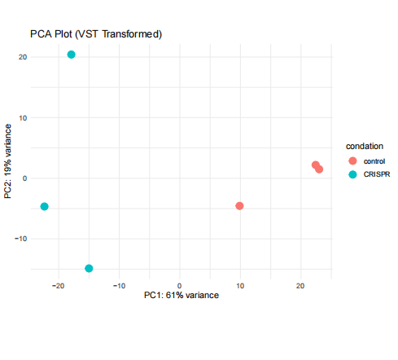
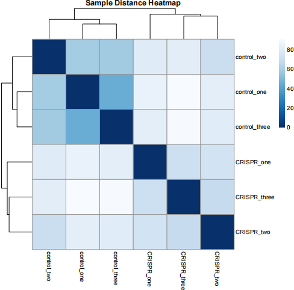
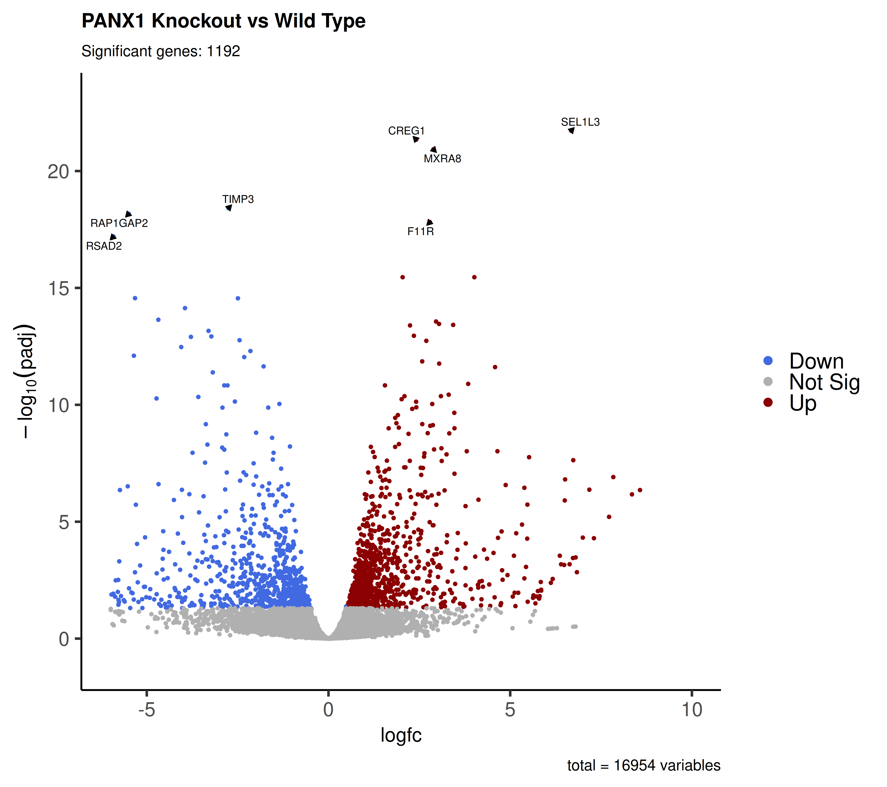
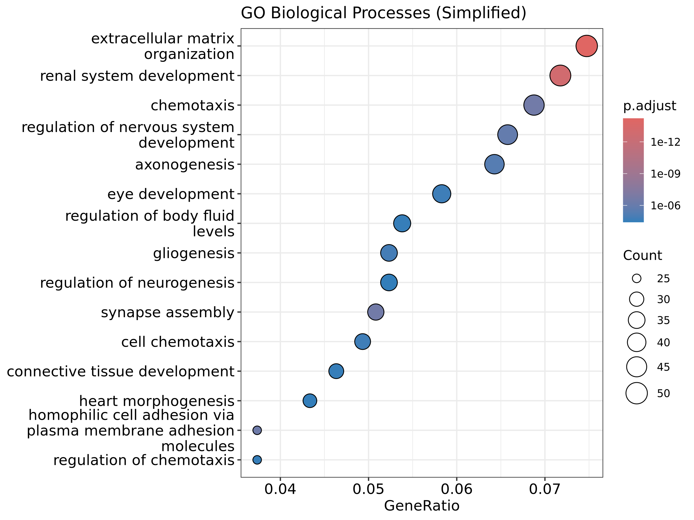
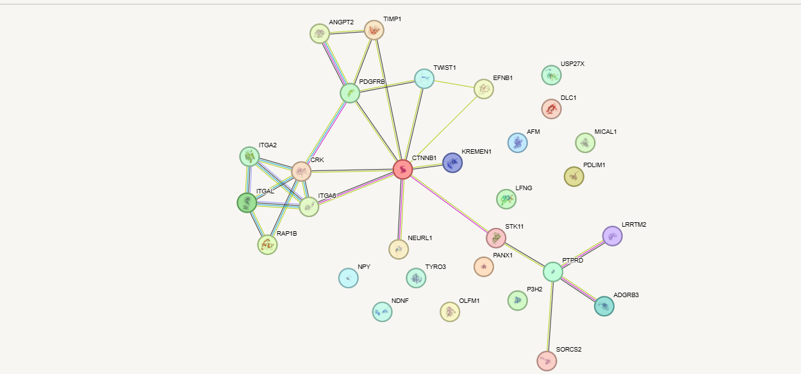

Bioinformatic Discovery: Uncovering the PANX1-CTNNB1 Adhesion Axis in Cancer

Written by Mohamed | Bioinformatics Analyst

---
 The Story Behind This Project

This repository represents an intense journey of data analysis, troubleshooting, and biological interpretation. What started as raw differential expression data evolved through meticulous coding into a compelling biological story about cancer invasion and cell adhesion.

During the script development, we encountered and resolved critical computational hurdles, including:
1. Resolving model coefficient issues in DESeq2 by properly configuring sample replicates.
2. Handling missing identifiers and unmapped gene symbols during Gene Ontology conversion.
3. Filtering statistical noise to extract true biological signals using adjusted p-values and log2 fold-change cutoffs.

Through these steps, the computational pipeline transformed raw expression values into clear, publishable insights.

---
 The Biological Revelation

The primary breakthrough came when integrating our differentially expressed genes into a functional protein-protein interaction network.

Key Findings:

- Central Hub Identification: 
  The gene CTNNB1 (Beta-catenin) emerged as the core central hub of the entire system.

- The PANX1 Connection: 
  Downregulation of PANX1 initiates a downstream signaling cascade through STK11 directly into CTNNB1.

- Functional Outcome: 
  This activation drives expression of key integrin complexes (ITGA2, ITGA6, RAP1B) and promotes extracellular matrix organization. 

Conclusion: 
Reducing PANX1 expression enhances cell-to-cell adhesion, directly suppressing the invasive and metastatic potential of tumor cells.

---

 Visual Evidence

Sample Quality & Expression Profiles

Differential Expression & Pathway Enrichment

The Core Interaction Network

Figure: Protein interaction network highlighting CTNNB1 as the master regulator connecting PANX1 to cell adhesion machinery.

---

 Methods & Tools

- Pipeline Steps: Quality Control (VST), Differential Expression (DESeq2), Functional Enrichment (clusterProfiler & simplify), and PPI Network Mapping (STRING).
- Environment: R, Bioconductor, and Linux Terminal.
-
